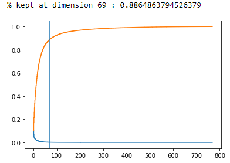
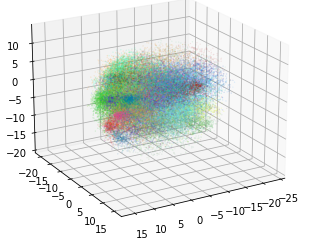
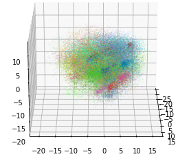

# humerus-bot

## Introduction

The humerus bot is a NLP project designed to *win* Cards Against Humanity.
This repository contains code for the [humerus bot](http://humerusdecks.com/#new) as well as artefacts/code from prior unsuccessful approaches.


## Background Information

[Cards Against Humanity](https://cardsagainsthumanity.com/) is a popular humor-based party game where one attempts to select the funniest response (white card) for a given prompt (black card).
The person who plays the funniest response "wins" the black card, and the first person to accumulate a predetermined number of black cards wins the overall game.
### Client
An existing cards against humanity implementation, [massive decks](https://github.com/Lattyware/massivedecks) was [forked](https://github.com/UTMIST/humerusdecks) and modified for game data collection and to integrate with our model backend.

This is packaged and deployed with docker on AWS. 

We used GPT-2 to generate a couple CAH decks for use but they ultimately did not make enough sense for a reasonable game experience. 


### Challenges 
Challenges our team largely concerned deployment [and its associated feasability].
We didn't want to spend a ton of money hosting a large model, not to mention having to keep the runtime under a manageable bound.
The cost and runtime constraint were a significant factor in design choices [recall: simple nn vs GPT-2 approach].

Another major challenge was figuring out just what makes something funny, and how we can capture that in our bot within allotted resource constraints.

### Server/Model

#### Causual Language Modelling Approach

Assuming that large causual language models e.g. GPT-2 can reasonably model text semantics and meanings (at least superficially), one may use them to determine a "funnyness score"


@ Alston, can you extend on this?

 To mention:
1. how it works
2. mention GLTR [source below] because we are basically implementing that
3. proposed weighted log sum for funnyness score
4. why it didn't work: resource constraints

#### Simple NN
With resource constraints in mind we then implemented a more lightweight model. 

1. Possible plays (white card + black card combination) are embedded with BERT and then PCA'd. 69 dimensions turned out to be a good number.
2. As pre-generating all embeddings for all plays would take up too much memory, it is assumed that the PCA matrix will not vary significantly for other plays and so is saved for on-the-fly embedding in deployment.
2. A simple two-layer dense predictive neural net is trained on collected game data. 
3. Networks is deployed via a simple flask API

We believe that BERT embeddings would be a good representation of text generated by the black card and white card combinations.
However, BERT embeddings are 768 dimensional; since we have 500 white cards, 66 one slot black cards, and 12 two slots black cards, it makes a total more than 3 million combinations of these 768-dimensional embeddings.
A neural network that takes in 768-dimensional features input is too big to be implemented on our server and storing them takes a lot of computational resources.
For this reason, we turned to PCA to reduce the BERT embeddings into smaller dimension but equally rich text representations.
Running PCA on 3 million embeddings is simply infeasible.
Hence, we ran PCA on a dataset consists of 33000 combinations from the one-slot black cards and 33000 sample combinations from the two-slot black cards.
Using the eigenvector matrix generated from this dataset, we generalize PCA to other combinations.


We found that reducing the BERT embeddings into 69 dimension keeps 88.6 % of the original representation while being at just about the inflection point of the % variance captured vs num_dimensions graph which is desirable.



To double check that our PCA works, we plotted a 3-dimensional PCA where each color represents a black card as shown above.
Note that 3-dimensional PCA only keeps 21.6 % of the original information but the clusters are already visible, showing that similar meaning sentences do tend to cluster.
Overall, the PCA approach looks promising and was therefore deployed in our final bot.

## Results

Here are some example plays


Are they funny? Judge for yourself at [humerusdecks](https://humerusdecks.com). 
By casual playing it seems that the result is funnier than random choice. 

## What's next
A logical next step for this project would be to benchmark its performance against random choice and other CAH bot implementations. 
It would also be interesting to compare and contrast the results from our deployed simple nn approach to the GPT-2 bot (or any other large casual language model).


## File & Folder Structure
```
.
├── data 
│   ├── cah-base-en.deck.json5
├── humerusbot
│   ├── bert
│   │   ├── api.py
│   │   ├── data
│   │   ├── models
│   │   ├── notebooks
│   │   │   ├── Bert Embeddings.ipynb
│   │   │   ├── humerus_prediction.ipynb
│   │   │   └── wordembed_to_bert_translation.ipynb
│   │   ├── train_script.py
│   │   └── utils
│   ├── gpt2
│   │   ├── Humerus_Finetuning.ipynb
│   │   └── Training_Huggingface.ipynb
│   └── utils
│       ├── CAH-Gen.ipynb
├── README.md
└── requirements.txt
```

## References
Another CAH bot implementation: [https://cpury.github.io/ai-against-humanity/](https://cpury.github.io/ai-against-humanity/)
GLTR: [http://gltr.io/](http://gltr.io)
GLTR Paper: [https://arxiv.org/abs/1906.04043][https://arxiv.org/abs/1906.04043]

### Team Members
```json5
{
        'Alston Lo' : "https://github.com/alstonlo",
        'Brian Chen' : "https://github.com/ihasdapie",
        'Matthew Ao' : "https://github.com/aoruize",
        'Jack Cai' : "https://github.com/caixunshiren",
        'Zoha Rehan' : "https://github.com/zoharehan"
}

```


